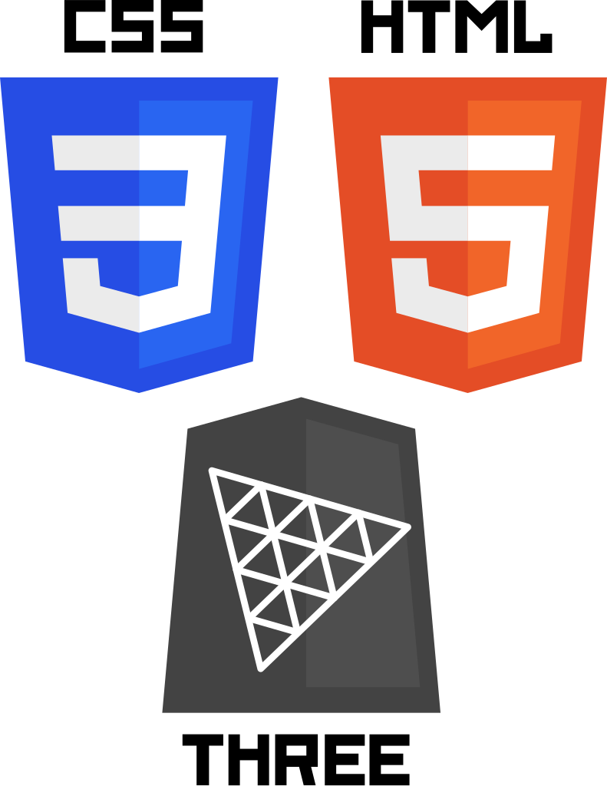

<h1 align="center">Three CSS Layout</h1>

<p align="center">
   
</p>

## Overview

TLDR - Three CSS Layout will fit any `Object3D` inside an animated `<div />`.

<p align="center">
   <video align="center" width="512" controls>
   <source src="./app/public/ThreeCssLayout.mp4" type="video/mp4" />
   </video>
</p>

Three CSS Layout aim to simplify the positioning, scaling and rotation of three.js objects relative to an HTML layout. Consists of two classes, the parent layout `CSSLayout` and its child objects `CSSLayoutObject`. The combination of these two classes allow you to take advantage of the HTML structure and emulate CSS responsiveness, transitions, keyframe animations and scroll inside a three.js environment.

## Getting Started

### Installation

You can include `three-css-layout` in your project by installing it using npm:

```bash
npm install three-css-layout
```

### Usage

1. **Initialize the parent `CSSLayout`:**

   ```javascript
   import { CSSLayout } from "three-css-layout";

   const cssLayout = new CSSLayout("#layout");
   ```

2. **Create your `CSSLayoutObject` child objects:**

   ```javascript
   import { CSSLayoutObject } from "three-css-layout";

   // First object
   const cssLayoutObject1 = new CSSLayoutObject("#three-model-1");
   cssLayoutObject1.add(my3DModel);

   // Second object
   const cssLayoutObject2 = new CSSLayoutObject("#three-group");
   cssLayoutObject2.add(myGroup);

   // ...

   // Add all your objects to the parent CSSLayout
   cssLayout.add(cssLayoutObject1, cssLayoutObject2);
   ```

3. **Fit Camera or Plane:**

   ```javascript
   // Fit the camera viewport
   const camera = new THREE.PerspectiveCamera(
     75,
     window.innerWidth / window.innerHeight,
     0.1,
     1000
   );
   cssLayout.fitCamera(camera, "cover");
   cssLayout.scroll();

   // OR

   // Fit a plane
   cssLayout.fitPlane(10, 5);
   ```

4. **Fit on window resize**

   For a 3D responsive design

   ```javascript
   function onWindowResize() {
    ...

    cssLayoutObject.fitCamera(camera, "cover");
   }
   ```

5. **Fit in the animation loop**\
   If you have a css animation or transitions, you can cam update the `CSSLayout` child objects in the animation loop.

   ```javascript
   function animation() {
    ...

    cssLayout.updateObjects();

    renderer.render(scene, camera);
   }
   ```

## Limitation

Three CSS Layout has the following considerations for optimal performance:

- **Animation Constraints:**

  - The library may encounter limitations when handling CSS animations involving the `transform` property **<u>combined</u>** with other CSS properties. To ensure optimal performance, consider utilizing either `transform` in isolation or alternative approaches for animations.

- **Dynamic Element Changes:**

  - For optimal performance, the library does not automatically recompute the `clientBoundingBox` when the dimensions (width, height...) or position (top, left, margin, etc.) of the HTML element change. To reflect these changes, you need to set `elementNeedsUpdate` to `true`. (This limitation does not apply to any css `transform` change).

  - Similarly, if the `Object3D` associated with the layout undergoes changes, set `objectNeedsUpdate` o `true` to reflect the changes.

## Contributing

Contributions are welcome! Fork the repository, make your changes, and submit a pull request.

## License

Licensed under the MIT License.

## Acknowledgments

Special thanks to the three.js community for inspiration and support.

---

Feel free to use, modify, and enhance Three CSS Layout to suit your needs. Happy coding!
